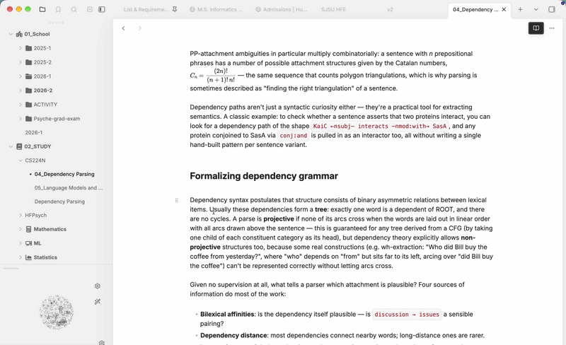
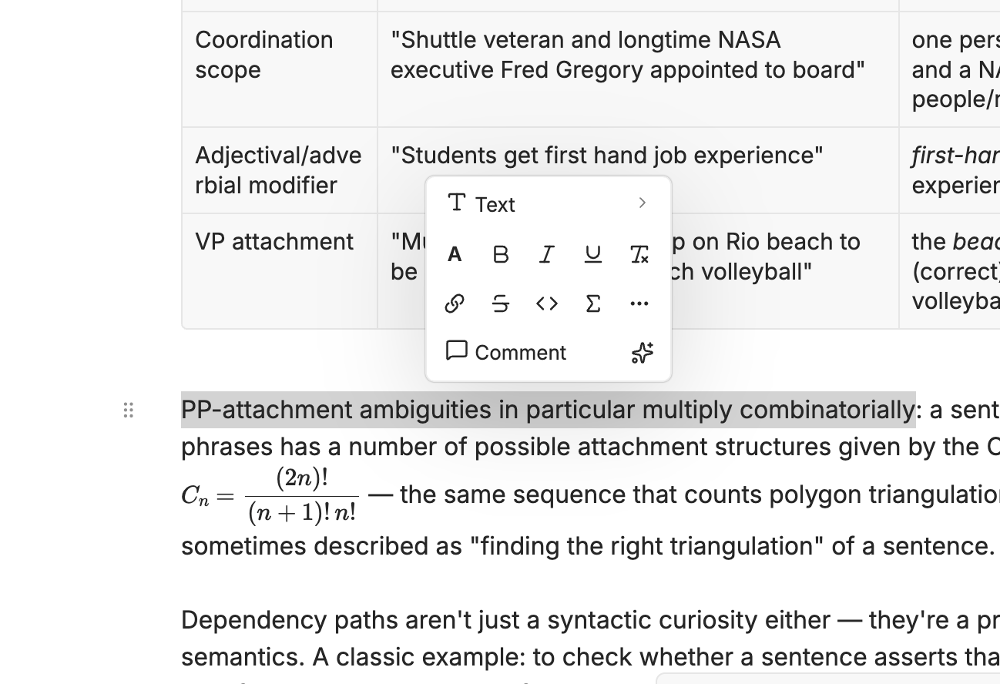
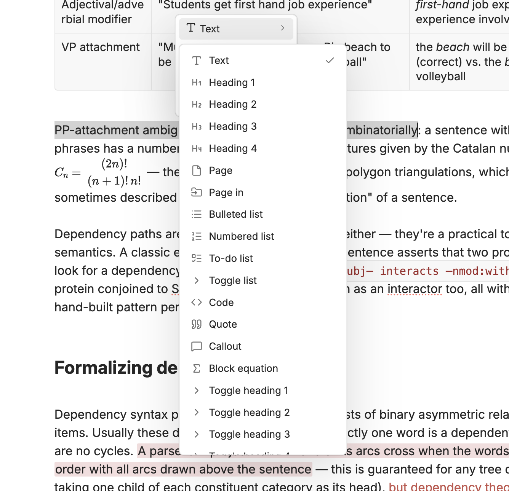
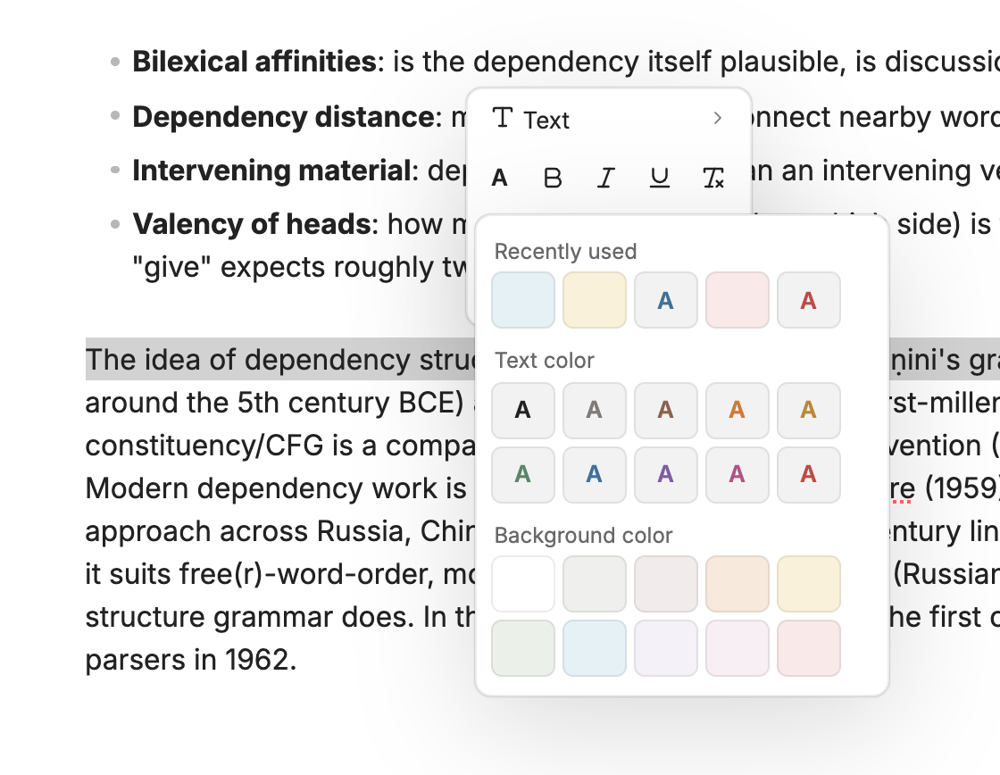
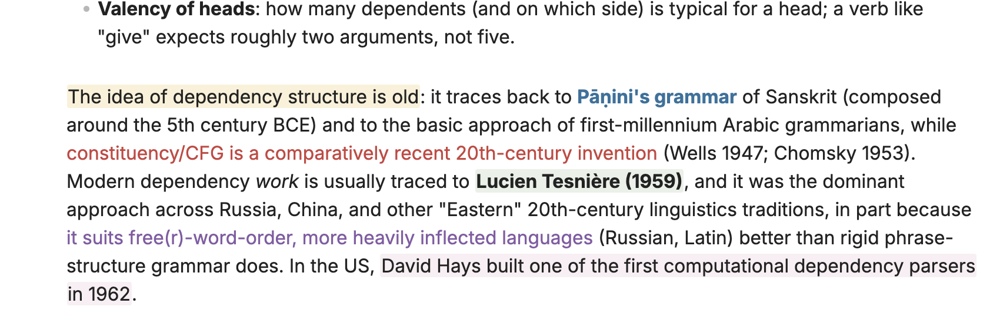
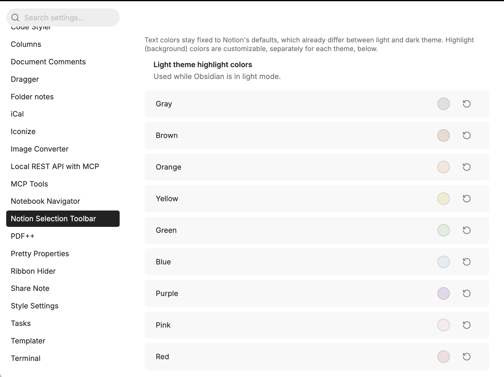

# Notion Selection Toolbar

A Notion-style floating toolbar for [Obsidian](https://obsidian.md). Select some text and a toolbar pops up above it. From there you can change the block type, color the text or highlight it, and apply inline formatting without typing any Markdown.

If you like it, [](https://buymeacoffee.com/jiwooroh)



## How to use

1. Open a note in **editing mode** (Live Preview or Source mode). The toolbar doesn't appear in Reading view.
2. **Select text** with the mouse or keyboard. The toolbar appears just above the selection, or below it if there's no room above.
3. Click a button to apply it. The selection stays in place, so you can stack several actions, for example a color, then bold, then italic.
4. Press **Esc** or click elsewhere to close the toolbar or any open menu.

### Toolbar layout

```
┌──────────────────────────────┐
│ ¶ Text ›                     │  Turn into (block type)
│ A   B   I   U   ⌫            │  Color · Bold · Italic · Underline · Clear formatting
│ 🔗  S̶   <>  Σ   ⋯            │  Link · Strikethrough · Inline code · Inline equation · More
│ 💬 Comment   ✨              │  Comment · Custom button
└──────────────────────────────┘
```



### Turn into (block type)

The top button shows the current line's block type (e.g. `Heading 2`). Click it to convert the selected line or lines:



| Menu item | Result |
| --- | --- |
| Text | Removes the heading, list, quote or callout marker |
| Heading 1–4 | `#` … `####` |
| Bulleted / Numbered / To-do list | `- `, `1. `, `- [ ] ` (renumbered automatically when you select several lines) |
| Quote | `> ` |
| Callout | Opens a submenu of Obsidian callout types (Note, Info, Tip, Warning, Danger, Bug, …) → `> [!type]` |
| Code | Wraps the lines in a ```` ``` ```` code block |
| Block equation | Wraps the lines in a `$$` math block |
| Toggle list / Toggle heading 1–4 | A collapsible `<details>` block. The selected text becomes the summary, and you type the hidden content on the next line |
| 2 columns | A two-column layout. The selected content goes in the left column |
| **Page** | Moves the selection into a new note in the same folder and leaves a `[[wikilink]]` in its place. The first line of the selection becomes the note's title |
| **Page in** | Same as Page, but first asks which folder to create the note in |

### Colors

Click **A** to open the color panel:



- **Text color**: 9 Notion colors (gray, brown, orange, yellow, green, blue, purple, pink, red)
- **Background color**: the same 9 colors as highlights
- **Default**: removes the color from the selection
- **Recently used**: your last 5 colors



Press **Cmd/Ctrl + Shift + H** to apply your most recently used color to the selection without opening the toolbar.

Colors follow your theme: applied colors switch automatically between light and dark mode.

> **Note:** Colors are saved as HTML (`<span class="nst-fg-red">`, `<mark class="nst-hl-yellow">`) and get their look from this plugin's CSS. If you disable the plugin, the text stays but the colors stop showing.

### Inline formatting

| Button | Markdown |
| --- | --- |
| Bold / Italic | `**text**` / `*text*` |
| Underline | `<u>text</u>` |
| Strikethrough | `~~text~~` |
| Inline code | `` `text` `` |
| Inline equation | `$text$` |
| Link | Type or paste a URL and press **Enter** → `[text](url)` |
| Clear formatting | Removes bold, italic, underline, strikethrough, highlights, colors, code and block markers from the selection |

Every button toggles: click it again on the same selection to remove the formatting. Formatting a colored selection works too, because the markers are placed inside the color tag so Live Preview renders them correctly.

### Other buttons

- **More (⋯)**: opens Obsidian's command palette.
- **Comment**: turns the selection into a native Obsidian comment, `%%text%%`, by running Obsidian's built-in **Toggle comment** command (the same as `Cmd/Ctrl + /`). Click again to remove the comment. Comments are hidden in Reading view and exports, and work anywhere Obsidian handles `%%` comments.

- **Custom button (✨)**: runs any command you assign to it in settings (see below).

## Settings

Go to **Settings → Notion Selection Toolbar**:



- **Light / Dark theme highlight colors**: change each background color separately for light and dark mode. Use the ↺ button to reset a color to its default. Highlights already in your notes update immediately.
- **Custom toolbar button**
  - **Command**: pick any command from the command palette for the button to run.
  - **Icon**: any [Lucide](https://lucide.dev/icons) icon name, e.g. `sparkles`, `star`, `zap`, `bookmark`.

## Commands & hotkeys

| Command | Default hotkey |
| --- | --- |
| Apply most recently used color | `Cmd/Ctrl + Shift + H` |
| Toggle strikethrough | – |
| Toggle underline | – |

You can bind or change hotkeys under **Settings → Hotkeys**.

## Installation (manual)

1. Download `main.js`, `manifest.json`, and `styles.css` from the [latest release](https://github.com/jiwooroh/notion-selection-toolbar/releases/latest).
2. Put them in `<your vault>/.obsidian/plugins/notion-selection-toolbar/` (create the folder if it doesn't exist).
3. Restart Obsidian, then enable **Notion Selection Toolbar** under **Settings → Community plugins**.

## Development

```bash
npm install
npm run dev
```

## License

MIT
